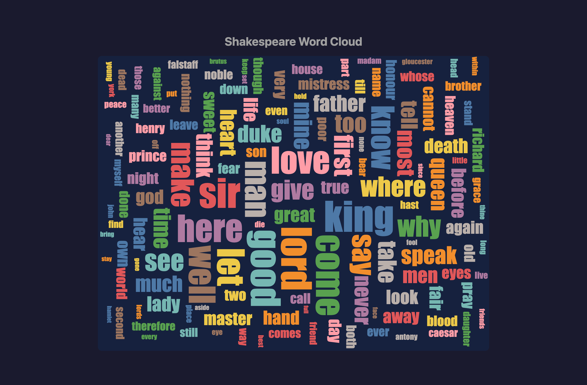

# Shakespeare Word Cloud

A word cloud visualization of the complete works of Shakespeare, built with D3.js and d3-cloud.

**[Live Demo](https://matanshavit.github.io/shakespeare-word-cloud/)**



## Features

- Loads the complete works of Shakespeare from Project Gutenberg
- Processes text to extract word frequencies (excluding common stopwords)
- Renders an interactive word cloud with hover tooltips showing word frequency
- Words are sized proportionally to their frequency

## Getting Started

```bash
# Install dependencies
pnpm install

# Start development server
pnpm dev

# Build for production
pnpm build
```

## Tech Stack

- [Vite](https://vitejs.dev/) - Build tool
- [D3.js](https://d3js.org/) - Data visualization
- [d3-cloud](https://github.com/jasondavies/d3-cloud) - Word cloud layout
